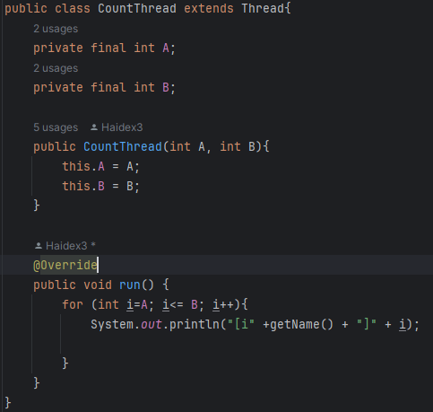
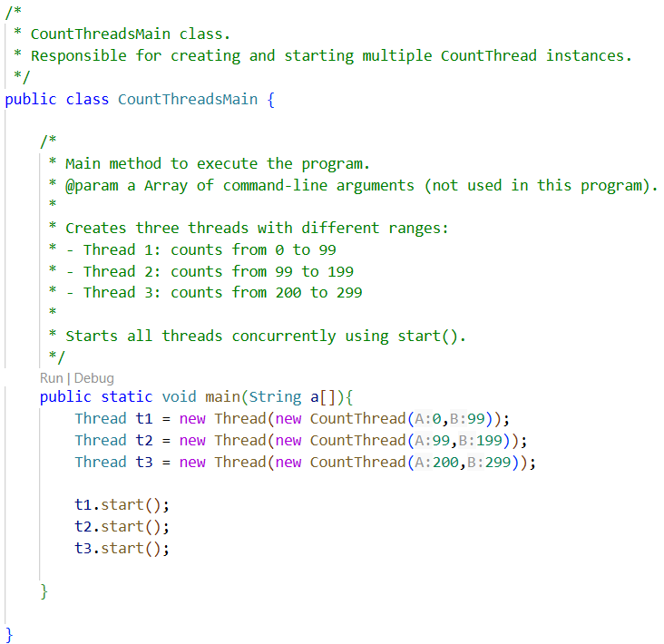
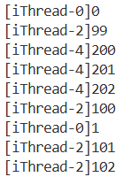
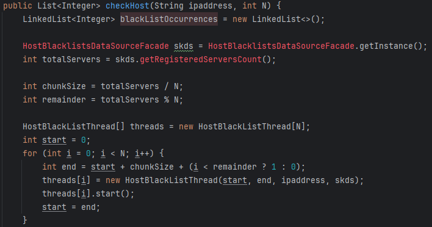
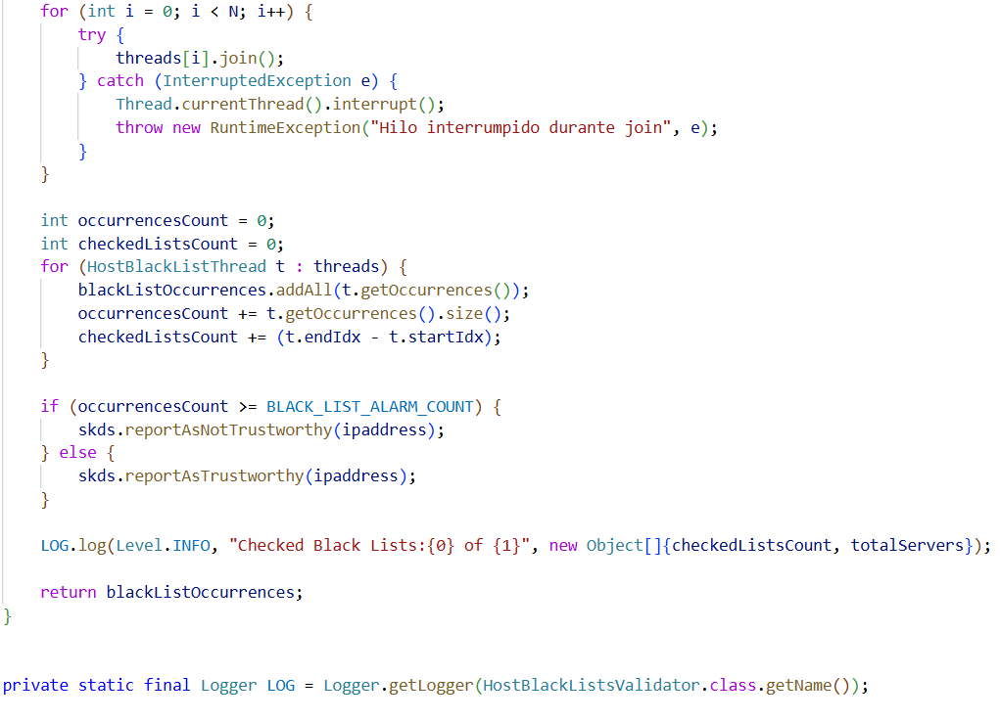
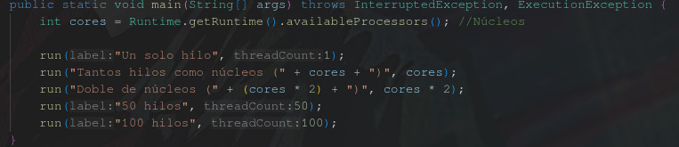
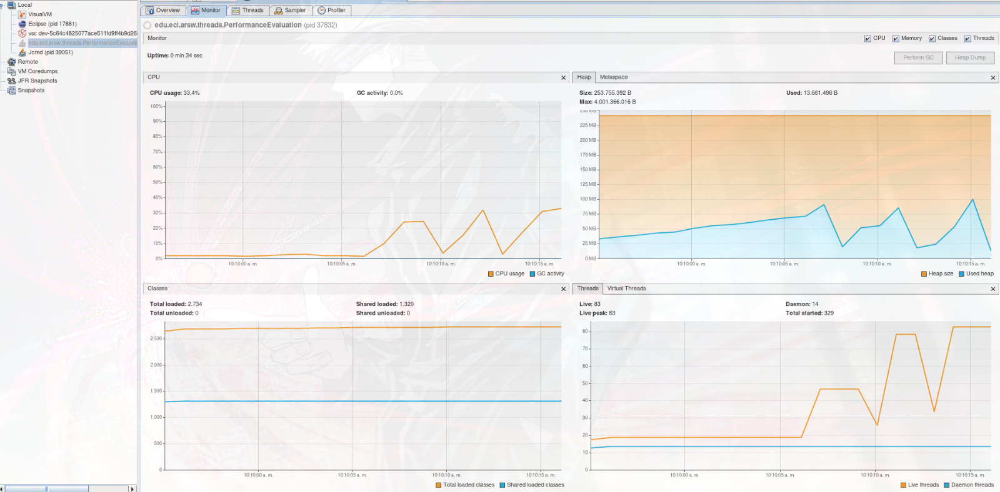

### Escuela Colombiana de Ingeniería
### Arquitecturas de Software - ARSW
## Ejercicio Introducción al paralelismo - Hilos - Caso BlackListSearch
## Autores: Emily Noreña y Haider Rodriguez

### Dependencias:
####   Lecturas:
*  [Threads in Java](http://beginnersbook.com/2013/03/java-threads/)  (Hasta 'Ending Threads')
*  [Threads vs Processes]( http://cs-fundamentals.com/tech-interview/java/differences-between-thread-and-process-in-java.php)

### Descripción
  Este ejercicio contiene una introducción a la programación con hilos en Java, además de la aplicación a un caso concreto.
  

**Parte I - Introducción a Hilos en Java**

1. De acuerdo con lo revisado en las lecturas, complete las clases CountThread, para que las mismas definan el ciclo de vida de un hilo que imprima por pantalla los números entre A y B.

Cada hilo creado recibe un rango de valores enteros [A, B] y, al ejecutarse, imprime en pantalla los números dentro de ese rango junto con el nombre del hilo que los generó.

**Ciclo de vida del hilo**
- Creación: Se instancia el objeto CountThread con los parámetros del rango.
- Inicialización: El hilo se pone en estado nuevo (new).
- Inicio: Al invocar start(), el hilo pasa al estado runnable.
- Ejecución: El método run() se ejecuta, realizando la tarea de contar e imprimir.
- Finalización: Cuando run() termina, el hilo entra en estado dead (muerto).

---

2. Complete el método __main__ de la clase CountMainThreads para que:
	1. Cree 3 hilos de tipo CountThread, asignándole al primero el intervalo [0..99], al segundo [99..199], y al tercero [200..299]. 
 	2. Inicie los tres hilos con 'start()'.

 	
 
 	3. Ejecute y revise la salida por pantalla. 
		
	

 	4. Cambie el incio con 'start()' por 'run()'. Cómo cambia la salida?, por qué?.

  	**Run**: No crea un nuevo hilo, ejecuta el método run() en el mismo hilo que lo invoca. No hay concurrencia.
   
   **Start**: Crea un nuevo hilo de ejecución. Internamente llama a run() pero en un hilo separado del principal.

**Parte II - Ejercicio Black List Search**

Para un software de vigilancia automática de seguridad informática se está desarrollando un componente encargado de validar las direcciones IP en varios miles de listas negras (de host maliciosos) conocidas, y reportar aquellas que existan en al menos cinco de dichas listas. 

Dicho componente está diseñado de acuerdo con el siguiente diagrama, donde:

- HostBlackListsDataSourceFacade es una clase que ofrece una 'fachada' para realizar consultas en cualquiera de las N listas negras registradas (método 'isInBlacklistServer'), y que permite también hacer un reporte a una base de datos local de cuando una dirección IP se considera peligrosa. Esta clase NO ES MODIFICABLE, pero se sabe que es 'Thread-Safe'.

- HostBlackListsValidator es una clase que ofrece el método 'checkHost', el cual, a través de la clase 'HostBlackListDataSourceFacade', valida en cada una de las listas negras un host determinado. En dicho método está considerada la política de que al encontrarse un HOST en al menos cinco listas negras, el mismo será registrado como 'no confiable', o como 'confiable' en caso contrario. Adicionalmente, retornará la lista de los números de las 'listas negras' en donde se encontró registrado el HOST.

Al usarse el módulo, la evidencia de que se hizo el registro como 'confiable' o 'no confiable' se dá por lo mensajes de LOGs:

INFO: HOST 205.24.34.55 Reported as trustworthy

INFO: HOST 205.24.34.55 Reported as NOT trustworthy

Al programa de prueba provisto (Main), le toma sólo algunos segundos análizar y reportar la dirección provista (200.24.34.55), ya que la misma está registrada más de cinco veces en los primeros servidores, por lo que no requiere recorrerlos todos. Sin embargo, hacer la búsqueda en casos donde NO hay reportes, o donde los mismos están dispersos en las miles de listas negras, toma bastante tiempo.

Éste, como cualquier método de búsqueda, puede verse como un problema [vergonzosamente paralelo](https://en.wikipedia.org/wiki/Embarrassingly_parallel), ya que no existen dependencias entre una partición del problema y otra.

Para 'refactorizar' este código, y hacer que explote la capacidad multi-núcleo de la CPU del equipo, realice lo siguiente:

1. Cree una clase de tipo Thread que represente el ciclo de vida de un hilo que haga la búsqueda de un segmento del conjunto de servidores disponibles. Agregue a dicha clase un método que permita 'preguntarle' a las instancias del mismo (los hilos) cuantas ocurrencias de servidores maliciosos ha encontrado o encontró.

La clase HostBlackListThread es un hilo que busca en un rango de servidores si una IP aparece en listas negras. Cada hilo:
- Revisa un segmento asignado de servidores.
- Registra los índices donde la IP fue encontrada.
- Permite consultar las ocurrencias detectadas mediante getOccurrences().

---

2. Agregue al método 'checkHost' un parámetro entero N, correspondiente al número de hilos entre los que se va a realizar la búsqueda (recuerde tener en cuenta si N es par o impar!). Modifique el código de este método para que divida el espacio de búsqueda entre las N partes indicadas, y paralelice la búsqueda a través de N hilos. Haga que dicha función espere hasta que los N hilos terminen de resolver su respectivo sub-problema, agregue las ocurrencias encontradas por cada hilo a la lista que retorna el método, y entonces calcule (sumando el total de ocurrencuas encontradas por cada hilo) si el número de ocurrencias es mayor o igual a _BLACK_LIST_ALARM_COUNT_. Si se da este caso, al final se DEBE reportar el host como confiable o no confiable, y mostrar el listado con los números de las listas negras respectivas. Para lograr este comportamiento de 'espera' revise el método [join](https://docs.oracle.com/javase/tutorial/essential/concurrency/join.html) del API de concurrencia de Java. Tenga también en cuenta:

	* Dentro del método checkHost Se debe mantener el LOG que informa, antes de retornar el resultado, el número de listas negras revisadas VS. el número de listas negras total (línea 60). Se debe garantizar que dicha información sea verídica bajo el nuevo esquema de procesamiento en paralelo planteado.

	* Se sabe que el HOST 202.24.34.55 está reportado en listas negras de una forma más dispersa, y que el host 212.24.24.55 NO está en ninguna lista negra.

El método checkHost permite verificar si una dirección IP sospechosa aparece en servidores de listas negras, distribuyendo la búsqueda en N hilos para mejorar el rendimiento. Cada hilo procesa un rango de servidores, almacena las ocurrencias encontradas y luego el método:
- Espera a que todos los hilos terminen (join).
- Combina las ocurrencias de cada hilo en una lista única.
- Calcula el total de coincidencias encontradas.
- Reporta el host como confiable o no confiable dependiendo si el número de ocurrencias supera BLACK_LIST_ALARM_COUNT.
- Registra en el LOG la cantidad de listas revisadas vs. el total disponible.

**Parte II.I Para discutir la próxima clase (NO para implementar aún)**

La estrategia de paralelismo antes implementada es ineficiente en ciertos casos, pues la búsqueda se sigue realizando aún cuando los N hilos (en su conjunto) ya hayan encontrado el número mínimo de ocurrencias requeridas para reportar al servidor como malicioso. Cómo se podría modificar la implementación para minimizar el número de consultas en estos casos?, qué elemento nuevo traería esto al problema?

**Parte III - Evaluación de Desempeño**

A partir de lo anterior, implemente la siguiente secuencia de experimentos para realizar las validación de direcciones IP dispersas (por ejemplo 202.24.34.55), tomando los tiempos de ejecución de los mismos (asegúrese de hacerlos en la misma máquina):

1. Un solo hilo.
2. Tantos hilos como núcleos de procesamiento (haga que el programa determine esto haciendo uso del [API Runtime](https://docs.oracle.com/javase/7/docs/api/java/lang/Runtime.html)).
3. Tantos hilos como el doble de núcleos de procesamiento.
4. 50 hilos.
5. 100 hilos.

---

Al iniciar el programa ejecute el monitor jVisualVM, y a medida que corran las pruebas, revise y anote el consumo de CPU y de memoria en cada caso.

(Pantallazo propio)

---

Con lo anterior, y con los tiempos de ejecución dados, haga una gráfica de tiempo de solución vs. número de hilos. Analice y plantee hipótesis con su compañero para las siguientes preguntas (puede tener en cuenta lo reportado por jVisualVM):

**Parte IV - Ejercicio Black List Search**

1. Según la [ley de Amdahls](https://www.pugetsystems.com/labs/articles/Estimating-CPU-Performance-using-Amdahls-Law-619/#WhatisAmdahlsLaw?):

	, donde _S(n)_ es el mejoramiento teórico del desempeño, _P_ la fracción paralelizable del algoritmo, y _n_ el número de hilos, a mayor _n_, mayor debería ser dicha mejora. Por qué el mejor desempeño no se logra con los 500 hilos?, cómo se compara este desempeño cuando se usan 200?. 

S(n) representa cuántas veces más rápido se ejecuta el programa usando n hilos, comparado con ejecutarlo con 1 solo hilo. Hicimos un ejemplo tomando P arbitrariamente como P=0.95 y obtuvimos:
- S(200)≈18.3
- S(500)≈19.3

La diferencia entre 200 y 500 hilos es muy poca (menos de 6%). El mejor desempeño no se logra con 500 hilos porque el paralelismo real está limitado por los núcleos físicos, y el exceso de hilos introduce costos crecientes de context switching, coherencia de caché y saturación de memoria.

---

2. Cómo se comporta la solución usando tantos hilos de procesamiento como núcleos comparado con el resultado de usar el doble de éste?.

- 8 núcleos: 3913 ms
- 16 núcleos: 3222 ms

Este resultado inesperado puede deberse a que cuando hay más hilos que núcleos, la CPU no puede ejecutarlos todos a la vez y recurre al cambio de contexto, donde debe guardar y restaurar el estado de los hilos. Esto genera overhead porque consume tiempo sin aportar cálculo real. En tareas muy intensivas de CPU, el rendimiento puede bajar ya que la CPU dedica más tiempo a cambiar de hilo que a procesar.

---

3. De acuerdo con lo anterior, si para este problema en lugar de 100 hilos en una sola CPU se pudiera usar 1 hilo en cada una de 100 máquinas hipotéticas, la ley de Amdahls se aplicaría mejor?. Si en lugar de esto se usaran c hilos en 100/c máquinas distribuidas (siendo c es el número de núcleos de dichas máquinas), se mejoraría?. Explique su respuesta.

**1 hilo en cada una de 100 máquinas**

En este caso tendríamos 100 núcleos físicos trabajando en paralelo, por lo tanto, la parte paralelizable del programa escalaría mejor y la Ley de Amdahl se aplicaría casi en su forma ideal. Sin embargo, tiene una limitación, ya que el costo de comunicación entre máquinas puede aparecer, pero si la tarea es independiente (embarrassingly parallel), la mejora sería casi lineal.

**c hilos en 100/c máquinas**

Cada máquina combina paralelismo interno (multinúcleo) con paralelismo distribuido, lo que disminuye el overhead de context switching, ya que cada núcleo puede ejecutar un hilo sin tanta competencia. De esta forma, el rendimiento mejora respecto al primer caso y resulta más eficiente que concentrar demasiados hilos en una sola CPU.

